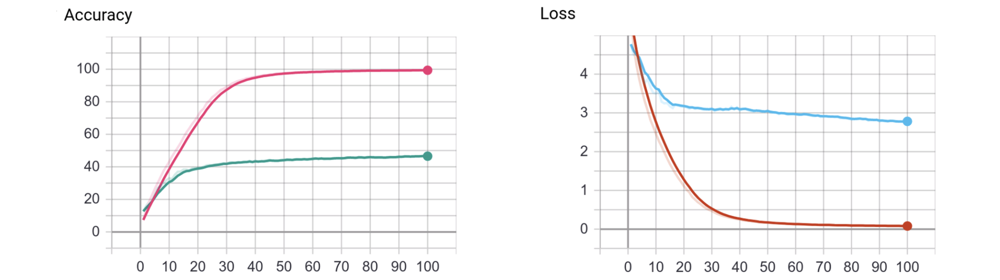

# Implementation of AlexNet using PyTorch
This implementation is an almost exact replica of the AlexNet paper in PyTorch, however there are many
common factors that were taken care such as:

1.  Data Augmentation is outside of main class and can be defined in a 
    semi declarative way using albumentations library inside the transformation.py class.
2.  Automatic Loading and Saving models from and to **checkpoint**. 
3.  Integration with **Tensor Board**. The Tensor Board data is being written after a checkpoint save.
    This is to make sure that, upon restarting the training, the plots are properly drawn.
        A.  Both Training Loss and Validation Accuracy is being written. The code will be modified to 
            also include Training Accuracy and Validation Loss.
        B.  The model is also being stored as graph for visualization.
4.  **Logging** has been enabled in both console and external file. The external file name can be configured 
    using the configuration in properties.py.
5.  **Multi-GPU Training** has been enabled using `torch.nn.DataParallel()` function. 
6.  **Mixed Precision** has been enabled using Nvidia's apex library as the PyTorch 1.6 is not released yet.
    None:   At this moment both Multi-GPU and Mixed Precision can not be using together. This will be fixed 
            once PyTorch 1.6 has been released. 

There are few differences between this implementation and original paper mostly due to obsolete/outdated concepts.
Each section will elaborate difference in detail along with additional explanations. 

## Dataset
The AlexNet paper uses ImageNet dataset, however here we will be using **Caltech256** dataset which consists of 256 
Categories and around 30K images. Any decent GPU should be able to train using this dataset in much lesser time than 
ImageNet.

In order to use ImagNet instead of Caltech256, please find the below blog post for more details.

http://www.adeveloperdiary.com/data-science/computer-vision/how-to-prepare-imagenet-dataset-for-image-classification/

Below is the URL of the Caltech256 Dataset.

http://www.vision.caltech.edu/Image_Datasets/Caltech256/#Details

### Pre-Processing
The pre-processing steps are same as AlexNet. Here are the steps:

1. Create Train/Validation Dataset ( Test labels are not given )
2. Center crop images 
3. Resize image to 256x256 Pixels
4. Calculate RGB Mean ( only on train set ) and finally save the global mean to a file named `rgb_val.json`.
    - The RGB mean values is used during training to normalize each images in `ClassificationDataset` class.
5. Moves the processed images to a different dir
6. Create a file name `categories.csv` with the list if class labels and corresponding ids.
7. Create train/val csv file with image name ( randomly generated ) and class id.

The `common.preprocessing.image_dir_preprocessor.py` class performs the pre processing tasks. 

None: In case of ImageNet, parallel processing is recommended. Please refer the below blog post for more details.

http://www.adeveloperdiary.com/data-science/computer-vision/imagenet-preprocessing-using-tfrecord-and-tensorflow-2-0-data-api/

### Data Augmentation
Following Data Augmentations are implemented using the albumentations library in the `AlexNet.transformation.py` file.

#### Training Data Augmentation    
1. Horizontal Reflection ( Flip )
2. Random Crop of 227x227

    - The AlexNet paper uses 224x224 random crop, however many believe the actual value is 227 instead of 224.
    - Also AlexNet uses 5 Crops ( 1 Center Crop and 4 sides crop), hence total 10 crops per images. However here we will
      Just use RandomCrop() feature of albumentations library. The effect should be very similar. 
             
3.  PCA Color Augmentation
    - Even though the AlexNet paper uses PCA Color Augmentation, this PyTorch implementation does not use that, as
      the batch normalization is powerful  to cancel the effect of PCA Color Augmentation. Please refer the github 
      project for more information.
      
      https://github.com/koshian2/PCAColorAugmentation
      
    
#### Testing Data Augmentation
1. Random Crop of 227x227 ( Same as training )
2. Mean RGB Normalization. 

## CNN Architecture
There are few differences in the CNN Model Architecture between this implementation and the AlexNet paper:

1. Use of **Batch Normalization** after the activation layer instead of **Local Response Normalization**. 
   AlexNet paper does not use Batch Normalization as it wasn't published at that time. Study indicates 
   Batch Normalization is more robust than Local Response Normalization.
2. Use **Max Pooling** instead of Average Pooling.
3. Use more Dropout layers ( after MaxPool layers ) to reduce over-fitting.
4. Use **Xavier Normal** initialization instead of initializing just from a normal distribution. 
   The He paper also refers the AlexNet paper with the following text:
   
 > Recent deep CNNs are mostly initialized by random weights drawn from Gaussian distributions

### Layers 
In PyTorch input image of 224 x 224 can be used as PyTorch ignores the fraction.

| **Layer Type** | **Output Size** | **Kernel Size** | **# of Kernels** | **Stride** | **Padding** |
|----------------|-----------------|-----------------|------------------|------------|-------------|
| Input Image    | 227 x 227 x 3   |                 |                  |            |             |
| Conv2d         | 57 x 57 x 96    | 11              | 96               | 4          |             |
| ReLU           | 57 x 57 x 96    |                 |                  |            |             |
| BatchNorm2d    | 57 x 57 x 96    |                 |                  |            |             |
| MaxPool2d      | 28 x 28 x 96    | 3               |                  | 2          |             |
| Dropout\*      | 28 x 28 x 96    |                 |                  |            |             |
| Conv2d         | 28 x 28 x 256   | 5               | 256              |            | 2           |
| ReLU           | 28 x 28 x 256   |                 |                  |            |             |
| BatchNorm2d    | 28 x 28 x 256   |                 |                  |            |             |
| MaxPool2d      | 13 x 13 x 256   | 3               |                  | 2          |             |
| Dropout\*      | 13 x 13 x 256   |                 |                  |            |             |
| Conv2d         | 13 x 13 x 384   | 3               | 384              |            | 1           |
| ReLU           | 13 x 13 x 384   |                 |                  |            |             |
| BatchNorm2d    | 13 x 13 x 384   |                 |                  |            |             |
| Conv2d         | 13 x 13 x 384   | 3               | 384              |            | 1           |
| ReLU           | 13 x 13 x 384   |                 |                  |            |             |
| BatchNorm2d    | 13 x 13 x 384   |                 |                  |            |             |
| Conv2d         | 13 x 13 x 256   | 3               | 256              |            | 1           |
| ReLU           | 13 x 13 x 256   |                 |                  |            |             |
| BatchNorm2d    | 13 x 13 x 256   |                 |                  |            |             |
| MaxPool2d      | 6 x 6 x 256     | 3               |                  | 2          |             |
| Dropout\*      | 6 x 6 x 256     |                 |                  |            |             |
| Flatten\(\)    | 6 x 6 x 256     |                 |                  |            |             |
| Linear         | 4096            |                 |                  |            |             |
| ReLU           | 4096            |                 |                  |            |             |
| BatchNorm2d    | 4096            |                 |                  |            |             |
| Dropout        | 4096            |                 |                  |            |             |
| Linear         | 4096            |                 |                  |            |             |
| ReLU           | 4096            |                 |                  |            |             |
| BatchNorm2d    | 4096            |                 |                  |            |             |
| Dropout        | 4096            |                 |                  |            |             |
| Linear         | 256             |                 |                  |            |             |
| LogSoftmax     | 256             |                 |                  |            |             |

### Architecture Diagram
Here is the original architecture diagram from the paper.


## Training
- Used **Stochastic Gradient Descent** with **Nesterov's momentum** 
- Initial **Learning Rate** has been set to `0.01`
- In AlexNet the learning rate was reduced manually 3 times, by a factor of 10 ( 0.01 -> 0.001 -> 0.0001 -> 0.00001).
  However here we will use **ReduceLROnPlateau** and reduce the learning rate by a factor of 0.5, if there are no improvements after 5 epochs

## Results
Here is the plot of Training/Validation Loss/Accuracy after 100 Epochs. The model is clearly over-fitting, 
more data augmentation will probably help. 



Even though `ReduceLROnPlateau` scheduler was used to decay learning rate, it wasn't effective as the training error kept reducing.
The scheduler started reducing the lr after around 170 epochs to 0.0003125 (Not shown in the plot). 


    

| **epochs**             | **Training Loss** | **Validation Accuracy** | **Training Accuracy** | **Learning Rate** |
|:----------------------:|:-----------------:|:-----------------------:|:---------------------:|:-----------------:|
| 100                    | 0\.0777           | 46\.5%                  | 99\.4%                | 0\.01             |
| 200 \( not in chart \) | 0\.0488           | 59\.3%                  | 99\.6%                | 0\.0003125        |

- The network was trained using single NVIDIA 2080ti and 32Bit Floating Point.
- 200 epochs took 60 minutes in training.     

## How to run the scripts
### Pre-Processing
- Run the following file:
    - `common.preprocessing.image_dir_preprocessor.py`
    - The properties can be changed at `common.preprocessing.properties.py`. Here is how the configurations are defined.
        ```python      
        # Provide the input preprocessing location
        INPUT_PATH = '/media/4TB/datasets/caltech/256_ObjectCategories'
        # Provide the output location to store the processed images
        OUTPUT_PATH = '/media/4TB/datasets/caltech/processed'
        # Validation split. Range - [ 0.0 - 1.0 ]
        VALIDATION_SPLIT = 0.2
        # Output image dimension. ( height,width )
        OUTPUT_DIM = (256, 256)
        # If RGB mean is needed, set this to True
        RGB_MEAN = True
        # If this is false, then the images will only be resized without preserving the aspect ratio.
        CENTER_CROP = True
        
        
        # Function to provide the logic to parse the class labels from the directory.
        def read_class_labels(path):
            return path.split('/')[-1].split('.')[-1]
        ```
### Training & Testing
- Run the following files:
    - `AlexNet.train.py` 
    - `AlexNet.test.py`
        - The test.py will automatically pickup the last saved checkpoint by training
- The properties can be changed at `AlexNet.properties.py`. Here is how the configurations are defined.
```python
config = dict()
config['PROJECT_NAME'] = 'alexnet'
config['INPUT_DIR'] = '/media/4TB/datasets/caltech/processed'

config['TRAIN_DIR'] = f"{config['INPUT_DIR']}/train"
config['VALID_DIR'] = f"{config['INPUT_DIR']}/val"

config['TRAIN_CSV'] = f"{config['INPUT_DIR']}/train.csv"
config['VALID_CSV'] = f"{config['INPUT_DIR']}/val.csv"

config['CHECKPOINT_INTERVAL'] = 10
config['NUM_CLASSES'] = 256
config['EPOCHS'] = 100  

config['MULTI_GPU'] = False
config['FP16_MIXED'] = False

config["LOGFILE"] = "output.log"
config["LOGLEVEL"] = "INFO"
```

### Console Output
I am executing the script remotely from pycharm. Here is a sample output of the train.py

```
sudo+ssh://home@192.168.50.106:22/home/home/.virtualenvs/dl4cv/bin/python3 -u /home/home/Documents/synch/mini_projects/AlexNet/executor.py
Building model ...
Training starting now ...
100%|██████████| 95/95 [00:19<00:00,  4.93 batches/s, epoch=1, loss=5.5523, val acc=12.708, train acc=7.348, lr=0.01]                                                                                   
100%|██████████| 95/95 [00:18<00:00,  5.17 batches/s, epoch=2, loss=4.7448, val acc=16.024, train acc=13.458, lr=0.01]                                                                                  
100%|██████████| 95/95 [00:18<00:00,  5.25 batches/s, epoch=3, loss=4.2328, val acc=18.474, train acc=18.54, lr=0.01]                                                                                   
100%|██████████| 95/95 [00:18<00:00,  5.13 batches/s, epoch=4, loss=3.8729, val acc=20.794, train acc=22.521, lr=0.01]                                                                                  
100%|██████████| 95/95 [00:18<00:00,  5.08 batches/s, epoch=5, loss=3.5686, val acc=24.698, train acc=26.456, lr=0.01]                                                                                  
100%|██████████| 95/95 [00:18<00:00,  5.15 batches/s, epoch=6, loss=3.2997, val acc=27.017, train acc=30.062, lr=0.01]                                                                                  
100%|██████████| 95/95 [00:18<00:00,  5.16 batches/s, epoch=7, loss=3.0673, val acc=27.916, train acc=33.68, lr=0.01]                                                                                   
100%|██████████| 95/95 [00:18<00:00,  5.05 batches/s, epoch=8, loss=2.8208, val acc=29.99, train acc=37.36, lr=0.01]                                                                                    
100%|██████████| 95/95 [00:18<00:00,  5.23 batches/s, epoch=9, loss=2.6457, val acc=31.787, train acc=40.23, lr=0.01]
```

     
## References
[[1] ImageNet Classification with Deep Convolutional Neural Networks](https://papers.nips.cc/paper/4824-imagenet-classification-with-deep-convolutional-neural-networks.pdf)

[[2] Batch Normalization: Accelerating Deep Network Training by Reducing Internal Covariate Shift](https://arxiv.org/abs/1502.03167) 

[[3] Understanding the difficulty of training deep feedforward neural networks](http://proceedings.mlr.press/v9/glorot10a/glorot10a.pdf)


