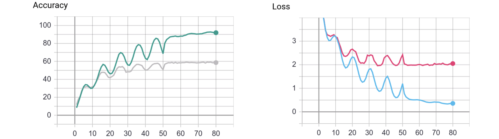
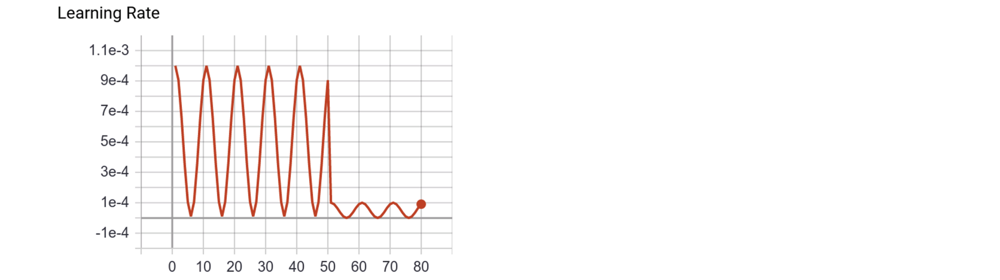

# Implementation of ResNet with Identity Mappings using PyTorch
This is the implementation of ResNet with Identity Mappings in PyTorch, however there are many other common factors that were taken care such as:

1.  Data Augmentation is outside of main class and can be defined in a 
    semi declarative way using albumentations library inside the transformation.py class.
2.  Automatic Loading and Saving models from and to **checkpoint**. 
3.  Integration with **Tensor Board**. The Tensor Board data is being written after a checkpoint save.
    This is to make sure that, upon restarting the training, the plots are properly drawn.
        A.  Both Training Loss and Validation Accuracy is being written. The code will be modified to 
            also include Training Accuracy and Validation Loss.
        B.  The model is also being stored as graph for visualization.
4.  **Logging** has been enabled in both console and external file. The external file name can be configured 
    using the configuration in properties.py.
5.  **Multi-GPU Training** has been enabled using `torch.nn.DataParallel()` function. 
6.  **Mixed Precision** has been enabled using Nvidia's apex library as the PyTorch 1.6 is not released yet.
    None:   At this moment both Multi-GPU and Mixed Precision can not be using together. This will be fixed 
            once PyTorch 1.6 has been released.
7.  The network layers sizes can be printed to console for verification.  

## Dataset
The ResNet paper used ImageNet dataset, however this implementation used another dataset named **Caltech256** which is very similar to Imagenet but 
consists of only 256 Categories and around 30K images. Any decent GPU should be able to train using this  dataset in much 
lesser time than ImageNet. 

In order to use ImagNet instead of Caltech256, please find the below blog post for more details.

[How to prepare imagenet dataset for image classification](http://www.adeveloperdiary.com/data-science/computer-vision/how-to-prepare-imagenet-dataset-for-image-classification/)

Below is the URL of the Caltech256 Dataset.

[Download Caltech 256 Dataset](/http://www.vision.caltech.edu/Image_Datasets/Caltech256/#Details)

### Pre-Processing
The pre-processing steps are similar to AlexNet. As ResNet hasn't recommended any additional improvements. 

1. Create Train/Validation Dataset ( Test labels are not given )
2. Resize the smaller side of the image to 256 and scale the larger side accordingly.. 
4. Calculate RGB Mean ( only on train set ) and finally save the global mean to a file named `rgb_val.json`.
    - The RGB mean values is used during training to normalize each images in `ClassificationDataset` class.
5. Moves the processed images to a different dir
6. Create a file name `categories.csv` with the list if class labels and corresponding ids.
7. Create train/val csv file with image name ( randomly generated ) and class id.

The `common.preprocessing.image_dir_preprocessor.py` class performs the pre processing tasks. 

None: In case of ImageNet, parallel processing is recommended. Please refer the below blog post for more details.

http://www.adeveloperdiary.com/data-science/computer-vision/imagenet-preprocessing-using-tfrecord-and-tensorflow-2-0-data-api/

### Data Augmentation
There were only few types of data augmentation used. Following Data Augmentations are implemented using the 
albumentations library in the `ResNet.transformation.py` file.

#### Training Data Augmentation    
1. Random Crop of 224x224    
2. Normalization 
3. ShiftScaleRotate
4. RandomBrightnessContrast
5. Equalize
3. Horizontal Flip    
    
#### Testing Data Augmentation
1. Random Crop of 224x224 ( Same as training )
2. Normalization 

## CNN Architecture

Here are some of the changed applied in this implementation.
1.  Use Xavier Normal initialization instead of initializing just from a normal distribution.  

Here are the layers defined by the authors.
 


Using the bottleneck design for better performance. Have 3 convolution layers, 1x1 (1/4 channel size) -> 3x3 (1/4 channel size) -> 1x1
This implementation uses ResNet with Identity Mappings, hence have the Batch Normalization layer before the convolution layer.


Here for the Caltech256 dataset used 29 layers of network with the following setup. 

### Layers 

Here is the layer structure of ResNet 50 architecture. 

| **Layer Type**           | **Output Size**     | **Kernel Size**     | **\# of Kernels**     | **Stride**     | **Padding**     |
|--------------------------|---------------------|---------------------|-----------------------|----------------|-----------------|
| Input Image              | 224 x 224 x 3       |                     |                       |                |                 |
| ConvWithPreActivation    | 112 x 112 x 64      | 7                   | 64                    | 2              | 3               |
| MaxPool2d                | 56 x 56 x 64        | 3                   |                       | 2              | 1               |
| **ResNetBottleNeck**         | 56 x 56 x 256       |                     |                       |                |                 |
| **ResNetBottleNeck**         | 56 x 56 x 256       |                     |                       |                |                 |
| **ResNetBottleNeck**         | 56 x 56 x 256       |                     |                       |                |                 |
| ResNetBottleNeck         | 28 x 28 x 512       |                     |                       |                |                 |
| ResNetBottleNeck         | 28 x 28 x 512       |                     |                       |                |                 |
| ResNetBottleNeck         | 28 x 28 x 512       |                     |                       |                |                 |
| ResNetBottleNeck         | 28 x 28 x 512       |                     |                       |                |                 |
| **ResNetBottleNeck**         | 14 x 14 x 1024      |                     |                       |                |                 |
| **ResNetBottleNeck**         | 14 x 14 x 1024      |                     |                       |                |                 |
| **ResNetBottleNeck**         | 14 x 14 x 1024      |                     |                       |                |                 |
| **ResNetBottleNeck**         | 14 x 14 x 1024      |                     |                       |                |                 |
| **ResNetBottleNeck**         | 14 x 14 x 1024      |                     |                       |                |                 |
| **ResNetBottleNeck**         | 14 x 14 x 1024      |                     |                       |                |                 |
| ResNetBottleNeck         | 7 x 7 x 2048        |                     |                       |                |                 |
| ResNetBottleNeck         | 7 x 7 x 2048        |                     |                       |                |                 |
| ResNetBottleNeck         | 7 x 7 x 2048        |                     |                       |                |                 |
| ResNetBottleNeck         | 7 x 7 x 2048        |                     |                       |                |                 |
| AdaptiveAvgPool2d        | 1 x 1 x 2048        |                     |                       |                |                 |
| Flatten                  | 1 x 2048            |                     |                       |                |                 |
| Linear                   | 1 x 256             |                     |                       |                |                 |
| LogSoftmax               | 1 x 256             |                     |                       |                |                 |

### Graphs
Below is the graph showing the two different types of Identity Mapping used in ResNet.

 

## Training & Result

### Experiment 1
Trained a smaller variant of ResNet, with 26 Convolution/FC layer has been used.
The config of the layers looks like below, where the first value of each tuple indicates the output filter/kernel size and
the 2nd value is the number of time that specific resnet module needs to be replicated.

```python
[(128, 2), (256, 2), (512, 2), (1024, 2)]
```  

So combining all the Convolution/FC Layers we get ResNet 26.

1 + 2\*3 + 2\*3 + 2\*3 + 2\*3 + 1  = 26 

#### Training Parameters
- Used **Stochastic Gradient Descent** with **Nesterov's momentum**      
- Initial **Learning Rate** for SGD has been set to `0.01` ( The authors used 0.001 as initial lr)
- In ResNet the learning rate was reduced manually, however we will be using Learning Rate Scheduler.
  We will use **ReduceLROnPlateau** and reduce the learning rate by a factor of 0.5, if there are no improvements after 3 epochs
    - ReduceLROnPlateau is dependent on the validation set accuracy.  

#### Result

Here is the plot of Training/Validation Loss/Accuracy after 120 Epochs. We can get more accuracy by using a larger model or
more advanced optimization technique. 


The is the plot of the learning rate decay.  


### Experiment 2
Trained another smaller variant of ResNet, with 20 Convolution/FC layer has been used.
The config of the layers looks like below, where the first value of each tuple indicates the output filter/kernel size and
the 2nd value is the number of time that specific resnet module needs to be replicated.

```python
[(128, 1), (256, 2), (512, 2), (1024, 1)]
```  

So combining all the Convolution/FC Layers we get ResNet 26.

1 + 1\*3 + 2\*3 + 2\*3 + 1\*3 + 1  = 20

#### Training Parameters
- Used **Adam** with **CosineAnnealingLR** learning rate scheduler.      
- Initial **Learning Rate** for Adam has been set to `0.001`
- The initial hyper-parameters of CosineAnnealingLR are set as following:
    - T_max   : 5
    - eta_min : 1e-5 
- After 50 epochs the **eta_min** hyper-parameter of CosineAnnealingLR was changed to 1e-7.

#### Result
Here is the plot of Training/Validation Loss/Accuracy after 80 Epochs. We can get more accuracy by using a larger model or
more advanced optimization technique. 



The is the plot of the learning rate decay.  



## Comparison with other architectures implemented
As shown below, the implemented model was able to achieve ~53% Accuracy while training from scratch. Also the accuracy flattens 
from epoch 80 and reducing the learning rate further didnt help to gain validation accuracy.

| **Architecture** | **epochs** | **Training Loss** | **Validation Accuracy** | **Training Accuracy** |
|:----------------:|:----------:|:-----------------:|:-----------------------:|:---------------------:|
| AlexNet          | 100        | 0\.0777           | 46\.51%                 | 99\.42%               |
| ZFNet            | 100        | 0\.0701           | 49\.67%                 | 99\.43%               |
| VGG13            | 70         | 0\.0655           | 53\.45%                 | 99\.08%               |
| GoogLeNet_SGD    | 70         | 0\.2786           | 55\.17%                 | 94\.89%               |
| GoogLeNet_Adam   | 90         | 0\.3104           | 61\.51%                 | 93\.64%               |
| Resnet26         | 80         | 0\.8853           | 53\.28%                 | 80\.86%               |
| Resnet20         | 80         | 0\.3557           | 59\.32%                 | 93\.54%               |

- The network was trained using 2 x NVIDIA 2080ti and 32Bit Floating Point.
- 80 training epochs took ~35-45 Minutes to complete.     

## How to run the scripts
### Pre-Processing
- Run the following file:
    - `common.preprocessing.image_dir_preprocessor.py`
    - The properties can be changed at `common.preprocessing.properties.py`. Here is how the configurations are defined.
        ```python      
        # Provide the input preprocessing location
        INPUT_PATH = '/media/4TB/datasets/caltech/256_ObjectCategories'
        # Provide the output location to store the processed images
        OUTPUT_PATH = '/media/4TB/datasets/caltech/processed'
        # Validation split. Range - [ 0.0 - 1.0 ]
        VALIDATION_SPLIT = 0.2
        # Output image dimension. ( height,width )
        OUTPUT_DIM = (256, 256)
        # If RGB mean is needed, set this to True
        RGB_MEAN = True
        # If this is true, then the images will only be resized while preserving the aspect ratio.
        CENTER_CROP = False
        # If this is true then the smaller side will be resized to the dimension defined above
        SMALLER_SIDE_RESIZE = True        
        
        # Function to provide the logic to parse the class labels from the directory.
        def read_class_labels(path):
            return path.split('/')[-1].split('.')[-1]
        ```
### Training & Testing
- Run the following files:
    - `ResNet.train.py` 
    - `ResNet.test.py`
        - The test.py will automatically pickup the last saved checkpoint by training
- The properties can be changed at `ResNet.properties.py`. Here is how the configurations are defined.

```python
config = dict()
config['PROJECT_NAME'] = 'resnet'
config['INPUT_DIR'] = '/media/4TB/datasets/caltech/processed'

config['TRAIN_DIR'] = f"{config['INPUT_DIR']}/train"
config['VALID_DIR'] = f"{config['INPUT_DIR']}/val"

config['TRAIN_CSV'] = f"{config['INPUT_DIR']}/train.csv"
config['VALID_CSV'] = f"{config['INPUT_DIR']}/val.csv"

config['CHECKPOINT_INTERVAL'] = 10
config['NUM_CLASSES'] = 256
config['EPOCHS'] = 80  

config['MULTI_GPU'] = True
config['FP16_MIXED'] = False

config["LOGFILE"] = "output.log"
config["LOGLEVEL"] = "INFO"
```

### Console Output
I am executing the script remotely from pycharm. Here is a sample output of the train.py

```
sudo+ssh://home@192.168.50.106:22/home/home/.virtualenvs/dl4cv/bin/python3 -u /home/home/Documents/synch/mini_projects/ResNet/train.py
Building model ...
Training starting now ...
100%|██████████| 191/191 [00:53<00:00,  3.58 batches/s, epoch=1, loss=5.3018, val acc=7.547, train acc=5.333, lr=0.01]                                                                                  
100%|██████████| 191/191 [00:52<00:00,  3.61 batches/s, epoch=2, loss=4.8669, val acc=10.568, train acc==9.178, lr=0.01]                                                                
100%|██████████| 191/191 [00:53<00:00,  3.59 batches/s, epoch=3, loss=4.6605, val acc=12.12, train acc=11.143, lr=0.01]                                                               
100%|██████████| 191/191 [00:53<00:00,  3.60 batches/s, epoch=4, loss=4.4931, val acc=11.107, train acc=12.891, lr=0.01]                                                               
100%|██████████| 191/191 [00:53<00:00,  3.59 batches/s, epoch=5, loss=4.3624, val acc=14.766, train acc=14.836, lr=0.01]                                                                
100%|██████████| 191/191 [00:53<00:00,  3.58 batches/s, epoch=6, loss=4.2257, val acc=17.38, train acc=16.201, lr=0.01]                                                                                                                                              
100%|██████████| 191/191 [00:53<00:00,  3.58 batches/s, epoch=8, loss=4.1086, val acc=15.567, train acc=17.689, lr=0.01]                                                                
100%|██████████| 191/191 [00:53<00:00,  3.59 batches/s, epoch=9, loss=3.9859, val acc=19.471, train acc=19.285, lr=0.01]
100%|██████████| 191/191 [00:53<00:00,  3.56 batches/s, epoch=10, loss=3.8662, val acc=18.458, train acc=21.118, lr=0.01]
```

## References
[[1] Identity Mappings in Deep Residual Networks](https://arxiv.org/pdf/1603.05027.pdf)

[[2] Deep Residual Learning for Image Recognition](https://arxiv.org/pdf/1512.03385.pdf)

[[3] Batch Normalization: Accelerating Deep Network Training by Reducing Internal Covariate Shift](https://arxiv.org/abs/1502.03167) 

[[4] Understanding the difficulty of training deep feedforward neural networks](http://proceedings.mlr.press/v9/glorot10a/glorot10a.pdf)


 


