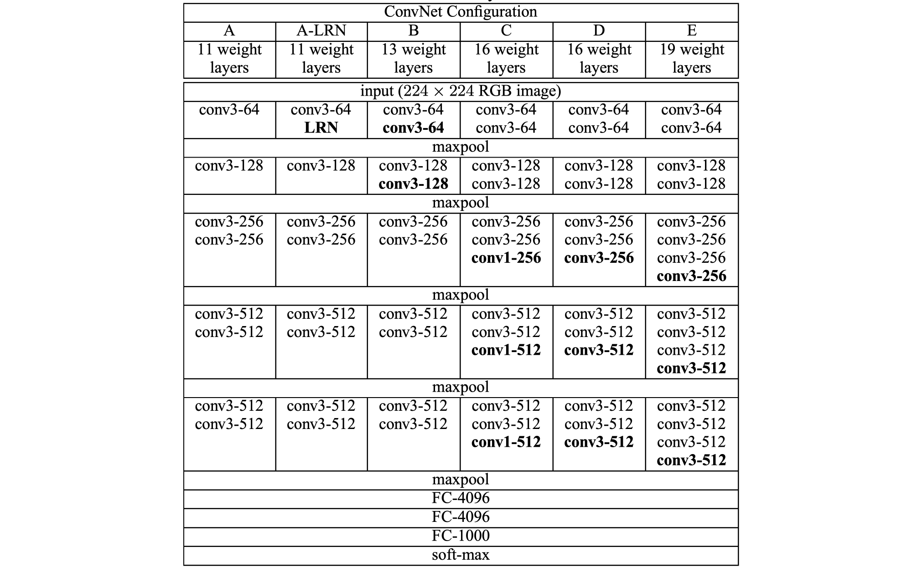
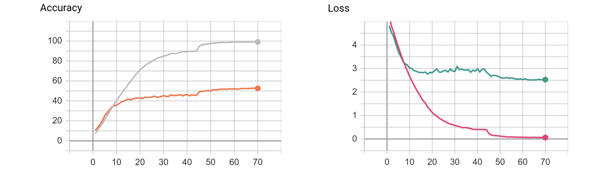
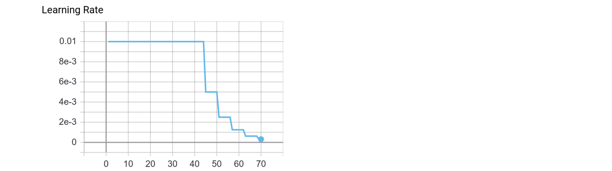

# Implementation of VGG using PyTorch
This implementation is an almost exact replica of the VGG paper in PyTorch, however there are many
common factors that were taken care such as:

1.  Data Augmentation is outside of main class and can be defined in a 
    semi declarative way using albumentations library inside the transformation.py class.
2.  Automatic Loading and Saving models from and to **checkpoint**. 
3.  Integration with **Tensor Board**. The Tensor Board data is being written after a checkpoint save.
    This is to make sure that, upon restarting the training, the plots are properly drawn.
        A.  Both Training Loss and Validation Accuracy is being written. The code will be modified to 
            also include Training Accuracy and Validation Loss.
        B.  The model is also being stored as graph for visualization.
4.  **Logging** has been enabled in both console and external file. The external file name can be configured 
    using the configuration in properties.py.
5.  **Multi-GPU Training** has been enabled using `torch.nn.DataParallel()` function. 
6.  **Mixed Precision** has been enabled using Nvidia's apex library as the PyTorch 1.6 is not released yet.
    None:   At this moment both Multi-GPU and Mixed Precision can not be using together. This will be fixed 
            once PyTorch 1.6 has been released.
7.  The network layers sizes can be printed to console for verification.  

There are few differences between this implementation and original VGG paper mostly due to obsolete/outdated concepts.

The authors of the paper faced difficulties to train such a deep network, hence they initially created a smaller network
**VGG11(A)** with 11 layers and initialized them using normal distribution. Once trained, they used the weights to initialize
a bit larger network **VGG13(B)** with 13 layers. This way they were able to train a 19 layer network referred as **VGG19(E)**

However later the authors tested **Xavier initialization** to directly train VGG19 and it was able to achieve same error rate 
as the original model. Hence instead of training separate models, which is very time consuming, I will be training the VGG
network using Xavier initialization.

## Dataset
The VGG paper used ImageNet dataset , however this implementation used another dataset named **Caltech256**, which is very similar to Imagenet but 
consists of only 256 Categories and around 30K images. Any decent GPU should be able to train using this  dataset in much 
lesser time than ImageNet. 

In order to use ImagNet instead of Caltech256, please find the below blog post for more details.

[How to prepare imagenet dataset for image classification](http://www.adeveloperdiary.com/data-science/computer-vision/how-to-prepare-imagenet-dataset-for-image-classification/)

Below is the URL of the Caltech256 Dataset.

[Download Caltech 256 Dataset](/http://www.vision.caltech.edu/Image_Datasets/Caltech256/#Details)

### Pre-Processing
The pre-processing steps are same as AlexNet. As VGG hasn't recommended any additional improvements. 

1. Create Train/Validation Dataset ( Test labels are not given )
2. Center crop images 
3. Resize image to 256x256 Pixels
4. Calculate RGB Mean ( only on train set ) and finally save the global mean to a file named `rgb_val.json`.
    - The RGB mean values is used during training to normalize each images in `ClassificationDataset` class.
5. Moves the processed images to a different dir
6. Create a file name `categories.csv` with the list if class labels and corresponding ids.
7. Create train/val csv file with image name ( randomly generated ) and class id.

The `common.preprocessing.image_dir_preprocessor.py` class performs the pre processing tasks. 

None: In case of ImageNet, parallel processing is recommended. Please refer the below blog post for more details.

http://www.adeveloperdiary.com/data-science/computer-vision/imagenet-preprocessing-using-tfrecord-and-tensorflow-2-0-data-api/

### Data Augmentation
There were only 2 types of data augmentation used. Following Data Augmentations are implemented using the 
albumentations library in the `VGGNet.transformation.py` file.

#### Training Data Augmentation    
1. Random Crop of 224x224
    - Original paper used center crop, I will be using Random Crop here.
2. Mean RGB Normalization ( Like AlexNet, ZFNet )     
    
#### Testing Data Augmentation
1. Random Crop of 224x224 ( Same as training )
2. Mean RGB Normalization. 

## CNN Architecture

Here are some of the changed applied in this implementation.

1. Use of **Batch Normalization** after the activation.
3. Use more Dropout layers ( after MaxPool layers ) to reduce over-fitting.
4. Use **Xavier Normal** initialization instead of initializing just from a normal distribution.
5. Use PReLU instead of ReLU. PReLU is similar to LeakyReLU, but instead of a fixed predetermined slope like 0.01
   it lets the network learn the best slope.

Here are layer design of the different architectures of various depth used by the authors. 



### Layers 
Even though this implementation supports all architectures - A, B, D ,E, we will be using B here as we have much smaller dataset
than imagenet. hence over fitting will be the major issue.    

| **Layer Type** | **Output Size** | **Kernel Size** | **# of Kernels** | **Stride** | **Padding** |
|----------------|-----------------|-----------------|------------------|------------|-------------|
| Input Image    | 224 x 224 x 3   |                 |                  |            |             |
| Conv2d         | 224 x 224 x 64  | 3               | 64               |            | 1           |
| PReLU          | 224 x 224 x 64  |                 |                  |            |             |
| BatchNorm2d    | 224 x 224 x 64  |                 |                  |            |             |
|                |                 |                 |                  |            |             |
| Conv2d         | 224 x 224 x 64  | 3               | 64               |            | 1           |
| PReLU          | 224 x 224 x 64  |                 |                  |            |             |
| BatchNorm2d    | 224 x 224 x 64  |                 |                  |            |             |
|                |                 |                 |                  |            |             |
| **MaxPool2d**      | 112 x 112 x 64  | 2               |                  | 2          |             |
| **Dropout**        | 112 x 112 x 64  |                 |                  |            |             |
|                |                 |                 |                  |            |             |
| Conv2d         | 112 x 112 x 128 | 3               | 128              |            | 1           |
| PReLU          | 112 x 112 x 128 |                 |                  |            |             |
| BatchNorm2d    | 112 x 112 x 128 |                 |                  |            |             |
|                |                 |                 |                  |            |             |
| Conv2d         | 112 x 112 x 128 | 3               | 128              |            | 1           |
| PReLU          | 112 x 112 x 128 |                 |                  |            |             |
| BatchNorm2d    | 112 x 112 x 128 |                 |                  |            |             |
|                |                 |                 |                  |            |             |
| **MaxPool2d**      | 56 x 56 x 128   | 2               |                  | 2          |             |
| **Dropout**        | 56 x 56 x 128   |                 |                  |            |             |
|                |                 |                 |                  |            |             |
| Conv2d         | 56 x 56 x 256   | 3               | 256              |            | 1           |
| PReLU          | 56 x 56 x 256   |                 |                  |            |             |
| BatchNorm2d    | 56 x 56 x 256   |                 |                  |            |             |
|                |                 |                 |                  |            |             |
| Conv2d         | 56 x 56 x 256   | 3               | 256              |            | 1           |
| PReLU          | 56 x 56 x 256   |                 |                  |            |             |
| BatchNorm2d    | 56 x 56 x 256   |                 |                  |            |             |
|                |                 |                 |                  |            |             |
| **MaxPool2d**      | 28 x 28 x 256   | 2               |                  | 2          |             |
| **Dropout**        | 28 x 28 x 256   |                 |                  |            |             |
|                |                 |                 |                  |            |             |
| Conv2d         | 28 x 28 x 512   | 3               | 512              |            | 1           |
| PReLU          | 28 x 28 x 512   |                 |                  |            |             |
| BatchNorm2d    | 28 x 28 x 512   |                 |                  |            |             |
|                |                 |                 |                  |            |             |
| Conv2d         | 28 x 28 x 512   | 3               | 512              |            | 1           |
| PReLU          | 28 x 28 x 512   |                 |                  |            |             |
| BatchNorm2d    | 28 x 28 x 512   |                 |                  |            |             |
|                |                 |                 |                  |            |             |
| **MaxPool2d**      | 14 x 14 x 512   | 2               |                  | 2          |             |
| **Dropout**        | 14 x 14 x 512   |                 |                  |            |             |
|                |                 |                 |                  |            |             |
| Conv2d         | 14 x 14 x 512   | 3               | 512              |            | 1           |
| PReLU          | 14 x 14 x 512   |                 |                  |            |             |
| BatchNorm2d    | 14 x 14 x 512   |                 |                  |            |             |
|                |                 |                 |                  |            |             |
| Conv2d         | 14 x 14 x 512   | 3               | 512              |            | 1           |
| PReLU          | 14 x 14 x 512   |                 |                  |            |             |
| BatchNorm2d    | 14 x 14 x 512   |                 |                  |            |             |
|                |                 |                 |                  |            |             |
| **MaxPool2d**      | 7 x 7 x 512     | 2               |                  | 2          |             |
| **Dropout**        | 7 x 7 x 512     |                 |                  |            |             |
|                |                 |                 |                  |            |             |
| Flatten\(\)    | 7 x 7 x 512     |                 |                  |            |             |
| Linear         | 4096            |                 |                  |            |             |
| ReLU           | 4096            |                 |                  |            |             |
| BatchNorm2d    | 4096            |                 |                  |            |             |
| Dropout        | 4096            |                 |                  |            |             |
| Linear         | 4096            |                 |                  |            |             |
| ReLU           | 4096            |                 |                  |            |             |
| BatchNorm2d    | 4096            |                 |                  |            |             |
| Dropout        | 4096            |                 |                  |            |             |
| Linear         | 256             |                 |                  |            |             |
| LogSoftmax     | 256             |                 |                  |            |             |

## Training
- Used **Stochastic Gradient Descent** with **Nesterov's momentum** 
- Initial **Learning Rate** has been set to `0.01` ( The authors used .001 as initial lr)
- In VGG the learning rate was reduced manually 3 times, by a factor of 10.
  However here we will use **ReduceLROnPlateau** and reduce the learning rate by a factor of 0.5, if there are no improvements after 3 epochs
- ReduceLROnPlateau is dependent on the validation set accuracy.  

## Results
Here is the plot of Training/Validation Loss/Accuracy after 70 Epochs on B Architecture. The model is clearly over-fitting, 
more data augmentation will probably help. 



The is the plot of the learning rate decay.  



### Comparison with AlexNet
As shown below, the implemented model was able to achieve 53.45% Accuracy while training from scratch.

| **Architecture** | **epochs** | **Training Loss** | **Validation Accuracy** | **Training Accuracy** |
|:----------------:|:----------:|:-----------------:|:-----------------------:|:---------------------:|
| AlexNet          | 100        | 0\.0777           | 46\.51%                 | 99\.42%               |
| ZFNet            | 100        | 0\.0701           | 49\.67%                 | 99\.43%               |
| VGG13            | 70         | 0\.0655           | 53\.45%                 | 99\.08%               |

- The network was trained using single NVIDIA 2080ti and 32Bit Floating Point.
- 70 training epochs took 201.26 Minutes to complete.     

## How to run the scripts
### Pre-Processing
- Run the following file:
    - `common.preprocessing.image_dir_preprocessor.py`
    - The properties can be changed at `common.preprocessing.properties.py`. Here is how the configurations are defined.
        ```python      
        # Provide the input preprocessing location
        INPUT_PATH = '/media/4TB/datasets/caltech/256_ObjectCategories'
        # Provide the output location to store the processed images
        OUTPUT_PATH = '/media/4TB/datasets/caltech/processed'
        # Validation split. Range - [ 0.0 - 1.0 ]
        VALIDATION_SPLIT = 0.2
        # Output image dimension. ( height,width )
        OUTPUT_DIM = (256, 256)
        # If RGB mean is needed, set this to True
        RGB_MEAN = True
        # If this is false, then the images will only be resized without preserving the aspect ratio.
        CENTER_CROP = True
        
        
        # Function to provide the logic to parse the class labels from the directory.
        def read_class_labels(path):
            return path.split('/')[-1].split('.')[-1]
        ```
### Training & Testing
- Run the following files:
    - `VGGNet.train.py` 
    - `VGGNet.test.py`
        - The test.py will automatically pickup the last saved checkpoint by training
- The properties can be changed at `VGGNet.properties.py`. Here is how the configurations are defined.
```python
config = dict()
config['PROJECT_NAME'] = 'vgg13'
config['INPUT_DIR'] = '/media/4TB/datasets/caltech/processed'

config['TRAIN_DIR'] = f"{config['INPUT_DIR']}/train"
config['VALID_DIR'] = f"{config['INPUT_DIR']}/val"

config['TRAIN_CSV'] = f"{config['INPUT_DIR']}/train.csv"
config['VALID_CSV'] = f"{config['INPUT_DIR']}/val.csv"

config['CHECKPOINT_INTERVAL'] = 10
config['NUM_CLASSES'] = 256
config['EPOCHS'] = 70  

config['MULTI_GPU'] = False
config['FP16_MIXED'] = False

config["LOGFILE"] = "output.log"
config["LOGLEVEL"] = "INFO"
```

### Console Output
I am executing the script remotely from pycharm. Here is a sample output of the train.py

```
sudo+ssh://home@192.168.50.106:22/home/home/.virtualenvs/dl4cv/bin/python3 -u /home/home/Documents/synch/mini_projects/VGGNet/train.py
Building model ...
Training starting now ...
100%|██████████| 765/765 [02:50<00:00,  4.49 batches/s, epoch=1, loss=5.2405, val acc=9.115, train acc=6.577, lr=0.01]                                                                                  
100%|██████████| 765/765 [02:51<00:00,  4.46 batches/s, epoch=2, loss=4.8757, val acc=11.908, train acc=9.551, lr=0.01]                                                                                 
100%|██████████| 765/765 [02:52<00:00,  4.45 batches/s, epoch=3, loss=4.6051, val acc=17.184, train acc=12.484, lr=0.01]                                                                                
100%|██████████| 765/765 [02:52<00:00,  4.45 batches/s, epoch=4, loss=4.3295, val acc=20.255, train acc=15.629, lr=0.01]                                                                                
100%|██████████| 765/765 [02:52<00:00,  4.44 batches/s, epoch=5, loss=4.044, val acc=22.264, train acc=19.248, lr=0.01]                                                                                 
100%|██████████| 765/765 [02:52<00:00,  4.44 batches/s, epoch=6, loss=3.7676, val acc=25.515, train acc=23.182, lr=0.01]                                                                                
100%|██████████| 765/765 [02:52<00:00,  4.44 batches/s, epoch=7, loss=3.4886, val acc=27.899, train acc=26.924, lr=0.01]                                                                                
100%|██████████| 765/765 [02:52<00:00,  4.43 batches/s, epoch=8, loss=3.231, val acc=29.86, train acc=31.148, lr=0.01]                                                                                  
100%|██████████| 765/765 [02:52<00:00,  4.43 batches/s, epoch=9, loss=2.9859, val acc=33.992, train acc=35.061, lr=0.01]
100%|██████████| 765/765 [02:53<00:00,  4.41 batches/s, epoch=10, loss=2.7667, val acc=34.27, train acc=38.468, lr=0.01]                                                                                
```

     
## References
[[1] VERY DEEP CONVOLUTIONAL NETWORKS FOR LARGE-SCALE IMAGE RECOGNITION](https://arxiv.org/pdf/1409.1556.pdf)

[[2] ImageNet Classification with Deep Convolutional Neural Networks](https://papers.nips.cc/paper/4824-imagenet-classification-with-deep-convolutional-neural-networks.pdf)

[[3] Batch Normalization: Accelerating Deep Network Training by Reducing Internal Covariate Shift](https://arxiv.org/abs/1502.03167) 

[[4] Understanding the difficulty of training deep feedforward neural networks](http://proceedings.mlr.press/v9/glorot10a/glorot10a.pdf)


 


